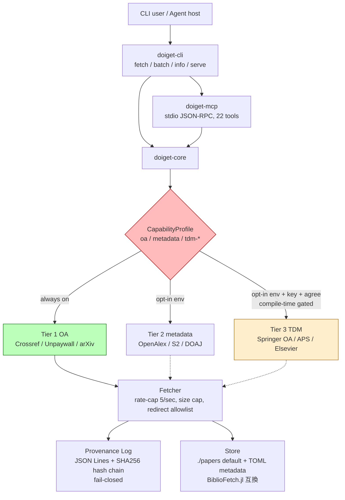
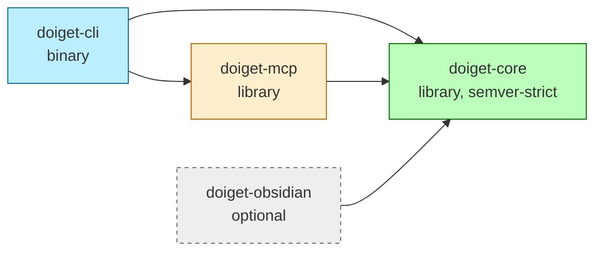
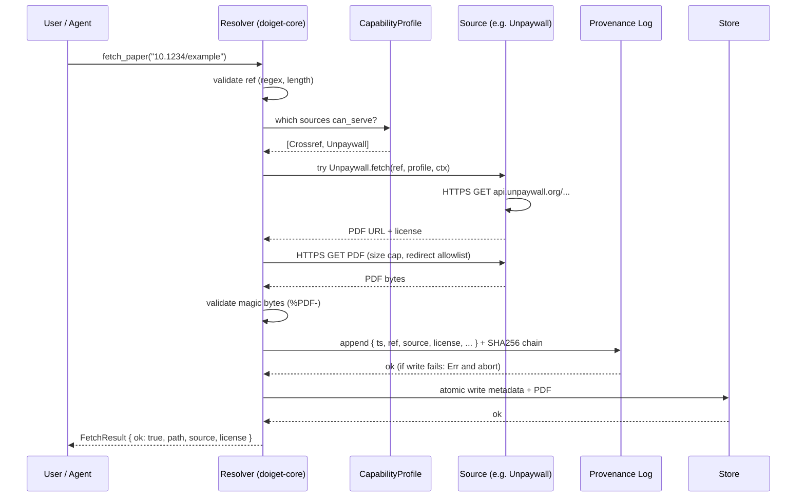

# Architecture

> **Status: INFORMATIVE.** This document describes the high-level architecture of doiget
> and is intended to orient new contributors. The binding contracts referenced from here
> live in their own NORMATIVE docs (each linked below).

---

## 1. One-paragraph summary

doiget is a Rust workspace of three crates (`doiget-core`, `doiget-cli`, `doiget-mcp`)
plus an optional fourth (`doiget-obsidian`). The library crate `doiget-core` defines the
abstract `Source` and `Store` traits and provides Open Access source implementations. A
runtime `CapabilityProfile` resolved from environment variables gates which sources are
allowed for the current invocation. CLI subcommands consume `doiget-core` directly. The
MCP server is a separate library that wraps `doiget-core` and is invoked from `doiget-cli`
via the `serve` subcommand. Every fetch passes through a fail-closed provenance log
(JSON Lines + SHA-256 hash chain) before reaching the store.

## 2. System diagram



## 3. Workspace layout

```
doiget/                              # workspace root
├── Cargo.toml                       # workspace + shared deps + features
├── Cargo.lock                       # committed
├── rust-toolchain.toml              # MSRV pin
├── deny.toml                        # cargo-deny banned crate list
├── clippy.toml                      # workspace lints
├── .cargo/config.toml               # build flags
│
├── crates/
│   ├── doiget-core/                 # ★ library, semver-strict
│   ├── doiget-cli/                  # binary `doiget`
│   ├── doiget-mcp/                  # MCP server library
│   └── doiget-obsidian/             # optional, default OFF
│
├── examples/
│   ├── 01-basic-fetch/
│   ├── 02-batch/
│   └── 03-mcp-host-integration/
│
├── tests/                           # integration tests
│   ├── cli_fetch.rs
│   ├── mcp_smoke.rs
│   ├── safekey_vectors.rs
│   ├── bibliofetch_roundtrip.rs
│   └── fixtures/
│
└── docs/                            # NORMATIVE + INFORMATIVE specs
```

See [ADR-0008](DECISIONS/) for the rationale of this layout.

## 4. Crate dependency graph



Forbidden directions (CI-enforced):

- `doiget-core` → `doiget-cli` (lib must not depend on bin).
- `doiget-core` → `doiget-mcp` (lib must not depend on server).
- `doiget-mcp` → `doiget-cli` (server must not depend on CLI).

## 5. Core trait surface (`doiget-core`)

```rust
pub trait Source: Send + Sync {
    fn name(&self) -> &str;
    fn can_serve(&self, profile: &CapabilityProfile, ref_: &Ref) -> bool;
    async fn fetch(&self, ref_: &Ref, profile: &CapabilityProfile, ctx: &FetchContext)
        -> Result<FetchResult, FetchError>;
}

pub trait Store: Send + Sync {
    fn read(&self, key: &Safekey) -> Result<Option<Metadata>, StoreError>;
    fn write(&self, key: &Safekey, m: &Metadata, pdf: Option<&Path>) -> Result<(), StoreError>;
    fn list_recent(&self, limit: usize) -> Result<Vec<EntryInfo>, StoreError>;
    fn search(&self, query: &str, limit: usize) -> Result<Vec<EntryInfo>, StoreError>;
}

pub enum Ref { Doi(Doi), Arxiv(ArxivId) }
pub struct Safekey(String);
pub struct Metadata { /* ... */ }
pub struct CapabilityProfile { /* see CAPABILITY.md */ }
```

The full normative API surface is in [`PUBLIC_API.md`](PUBLIC_API.md). This is the
semver-locked public contract for `doiget-core`.

## 6. Data flow: a single `fetch_paper(doi)`



## 7. Document index

| Document | Status | Topic |
|---|---|---|
| [README.md](../README.md) | Entry | Project overview, posture |
| [LEGAL.md](LEGAL.md) | NORMATIVE | Posture, jurisdictional caveat, eight safeguards |
| [SCOPE.md](SCOPE.md) | NORMATIVE | Permanent non-goals |
| [SECURITY.md](SECURITY.md) | NORMATIVE | Threat model, supply chain |
| [STORE.md](STORE.md) | NORMATIVE | Store layout, schema versioning, flock, atomic write |
| [SAFEKEY.md](SAFEKEY.md) | NORMATIVE | safekey algorithm + reference test vectors |
| [CAPABILITY.md](CAPABILITY.md) | NORMATIVE | CapabilityProfile spec, env var precedence |
| [PROVENANCE_LOG.md](PROVENANCE_LOG.md) | NORMATIVE | JSON Lines + hash chain log spec |
| [CACHE.md](CACHE.md) | NORMATIVE | Resolver / citation cache layout, TTL |
| [ERRORS.md](ERRORS.md) | NORMATIVE | Error taxonomy × persona presentation |
| [CONFIG.md](CONFIG.md) | NORMATIVE | env / file / flag precedence |
| [PUBLIC_API.md](PUBLIC_API.md) | NORMATIVE | semver-locked Rust API surface |
| [MCP_TOOLS.md](MCP_TOOLS.md) | NORMATIVE | MCP tool spec (9 + 3) |
| [SOURCES.md](SOURCES.md) | NORMATIVE | Source list, ToS links, prerequisites |
| [PHASES.md](PHASES.md) | INFORMATIVE | Phase plan + Phase 0 deliverable checklist |
| [MIGRATION.md](MIGRATION.md) | INFORMATIVE | BiblioFetch.jl ↔ doiget migration |
| [INTEGRATION/](INTEGRATION/) | INFORMATIVE | MCP host install snippets |
| [DECISIONS/](DECISIONS/) | NORMATIVE | ADRs (Architecture Decision Records) |
| [CONTACT.md](../CONTACT.md) | Entry | Takedown / SLA / DMCA / security disclosure |
| [CONTRIBUTING.md](../CONTRIBUTING.md) | Process | PR rules, doc style, scope-reopening meta-rule |

## 8. Phase plan

The MVP (core resolver + Tier 1 sources + `fetch` / `batch` CLI, store +
`info` / `search` / `bib` / `csl`, MCP server + tools + strict stdio) plus
Tier 2 sources, the citation graph, and feature-gated Tier 3 TDM are shipped.
The optional `doiget-obsidian` crate is the remaining per-feature work. The
historical phase breakdown is in [`PHASES.md`](PHASES.md).

## 9. Cross-tool relationship with BiblioFetch.jl

doiget shares the on-disk store format with [BiblioFetch.jl](https://github.com/sotashimozono/BiblioFetch.jl).
The boundary contracts are documented as part of [`STORE.md`](STORE.md):

- TOML schema versioning (`schema_version = "1.0"`).
- Concurrent access via `flock` on `<safekey>.toml.lock`.
- Atomic write protocol (`tmp` → `fsync` → `rename` → `fsync` parent).
- A shared `safekey` algorithm with 100 reference test vectors in
  [`SAFEKEY.md`](SAFEKEY.md).

## 10. Where to start as a new contributor

1. Read [README.md](../README.md) and [CONTRIBUTING.md](../CONTRIBUTING.md).
2. Read [LEGAL.md](LEGAL.md) and [SCOPE.md](SCOPE.md). These set the boundaries on what
   contributions are accepted.
3. Skim [DECISIONS/](DECISIONS/) — the ADRs explain why doiget is shaped the way it is.
4. Open an issue to discuss a contribution, keeping it within the boundaries
   set by [LEGAL.md](LEGAL.md) and [SCOPE.md](SCOPE.md).
