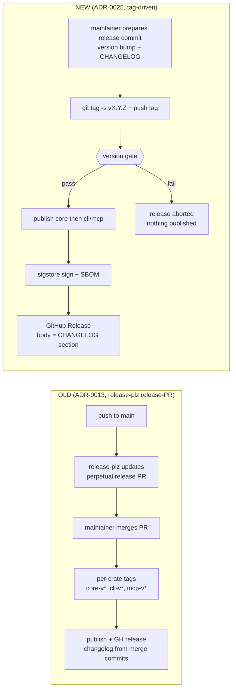
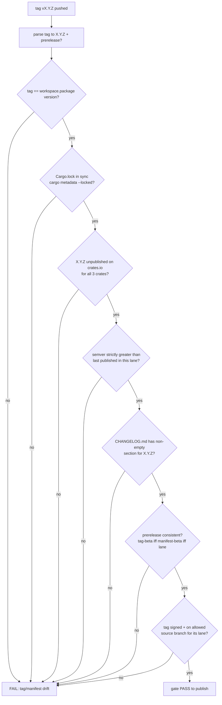
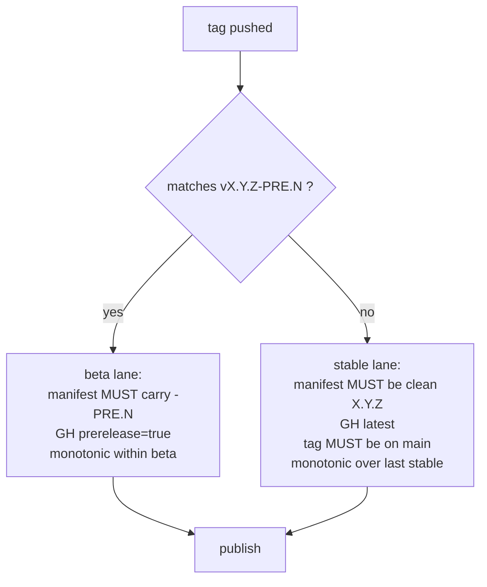
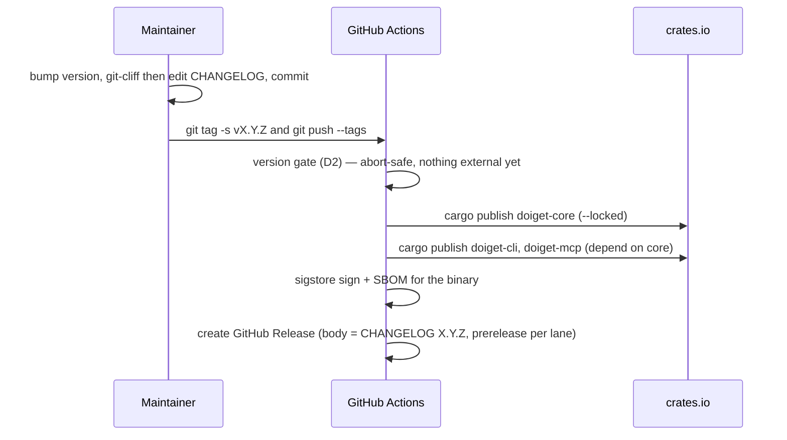
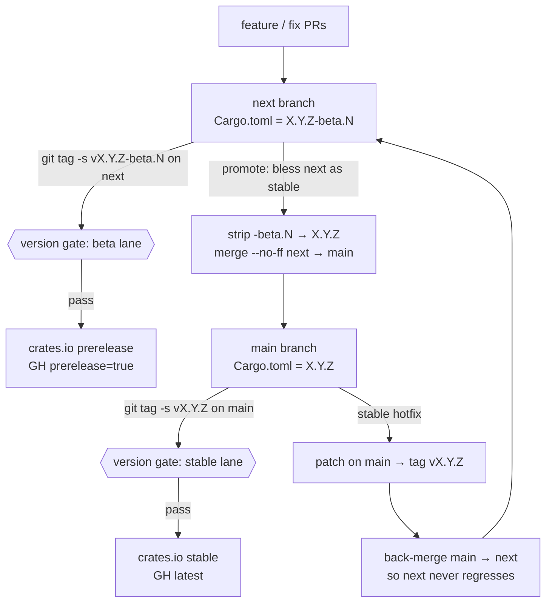

# 0025 - Tag-driven release with a mandatory version gate and beta/stable lanes

- **Date:** 2026-05-17
- **Status:** Accepted — implemented by PR #166 (`.github/workflows/release.yml` + `scripts/release-version-gate.sh` + `cliff.toml`/`scripts/release-changelog.sh`; `release-plz.{toml,yml}` removed; `release-sign.yml`/`release-sbom.yml` demoted to `workflow_dispatch`-only and folded into `release.yml`). `0013`'s release portion is `Superseded by 0025` (its CI-baseline / posture-lint / SHA-pin / Dependabot decisions stand).
- **Supersedes:** 0013 (release portion only — the CI baseline / posture-lint / SHA-pin / Dependabot decisions of 0013 stand)
- **Source:** Maintainer release-workflow review, 2026-05-17 (release-plz `release-PR` model rejected after the v0.1.4 `#164` changelog defect)

## Context

ADR-0013 adopted **release-plz** in its *release-PR* mode: every push to `main`
opens/updates one perpetual "release PR" that bumps the workspace version and
appends to `CHANGELOG.md`; merging that PR mints per-crate tags
(`doiget-core-v*`, `doiget-cli-v*`, `doiget-mcp-v*`), creates GitHub Releases,
and `cargo publish`es to crates.io via OIDC. `release-sign.yml` and
`release-sbom.yml` already trigger on `push: tags: doiget-cli-v*`.

Two concrete failures of that model surfaced on 2026-05-17:

1. **Changelog defect (`#164`).** PRs `#159/#160/#161/#162/#163/#165` were
   merged as merge commits. release-plz's git-cliff changelog generation keyed
   off the merge-commit subjects (`Merge pull request #NNN …`), so the
   generated `## [0.1.4]` section captured only **one** `fix(core)` line plus a
   stray `Merge remote-tracking branch …` line, silently dropping the MCP
   spec-conformance, CLI exit-code-contract, credential-hygiene and docs work.
   crates.io versions are immutable; merging `#164` would have published an
   immutable, materially inaccurate public release record.

2. **Ergonomic mismatch.** The "release intent" is buried in *merging a
   long-lived PR* rather than in an explicit, reviewable act. The maintainer
   wants the obsidian-remote-ssh / Julia-Registrator+TagBot ergonomic where the
   **tag is the release**, tag↔publish↔GitHub-Release are tightly coupled, and
   there is no perpetual PR to babysit.

crates.io has **no dist-tag mechanism** (no npm-style `@beta`). The only
crates.io-native pre-release channel is a **SemVer pre-release identifier**
(`1.2.3-beta.1`), which `cargo` will not auto-select unless a consumer opts in
explicitly. Any beta/stable split must be expressed through SemVer, not a
registry-side channel.

The three crates share one version (`version.workspace = true`), so a single
workspace tag is sufficient; the per-crate `doiget-<crate>-v*` tag scheme that
release-plz imposed is unnecessary surface.

## Decision

Replace the release-plz release-PR model with a **tag-driven release
pipeline** whose only entry point is pushing an annotated, signed tag, gated by
a mandatory version-consistency job.

### D1 — Trigger: a single workspace tag is the release

- New workflow `.github/workflows/release.yml`, `on: push: tags: ['v*']`.
- **One** workspace tag `vX.Y.Z` (or `vX.Y.Z-beta.N`). The per-crate
  `doiget-<crate>-v*` tag scheme is retired. `release-sign.yml` /
  `release-sbom.yml` are re-pointed from `doiget-cli-v*` to `v*` (or folded
  into `release.yml` as jobs).
- `release-plz.yml` and `release-plz.toml` are **removed**. Version bump +
  `CHANGELOG.md` editing become an explicit pre-tag step (script-assisted, see
  D4), not an auto-PR.
- Tags MUST be annotated and GPG-signed (`git tag -s`); the gate verifies this.

### D2 — Mandatory version gate (runs first; abort on any failure)

The gate is the structural fix for the `#164` class of defect: **a release
cannot proceed unless `CHANGELOG.md` already contains a non-empty section for
exactly this version.** No publish step runs until the gate is green.

### D3 — beta / stable lanes via SemVer pre-release

| Tag | Lane | crates.io | GitHub Release | Allowed source |
| --- | --- | --- | --- | --- |
| `vX.Y.Z-beta.N` | **beta** | published as SemVer pre-release (not auto-selected by `cargo`) | `prerelease: true`, not "latest" | `next` only |
| `vX.Y.Z` | **stable** | normal publish | `prerelease: false`, "latest" | `main` only |

Consumers opt into beta explicitly (`cargo add doiget-cli@=X.Y.Z-beta.N` or
`--pre`); there is intentionally no implicit `@beta` convenience because
crates.io has no dist-tags.

### D4 — CHANGELOG strategy

`CHANGELOG.md` stays a single hand-curated workspace file (as today). For each
release the maintainer runs a local helper that invokes **git-cliff** over the
range `<last-tag-in-lane>..HEAD` with a `cliff.toml` configured to traverse
**all** commits (not first-parent) so conventional commits behind merge commits
are not lost — the exact failure mode of `#164`. The generated section is
**reviewed and edited** before the release commit is made. The version gate
(D2-G5) then enforces that the section exists and is non-empty at tag time.
git-cliff replaces release-plz purely as a *local, pre-tag, reviewable*
changelog generator — never as an automated merge-time PR.

### D5 — Pipeline order & irreversibility handling

Irreversibility is contained by ordering: every reversible/abortable check
(the entire gate) happens **before** the first irreversible action
(`cargo publish`). crates.io publish is per-crate sequential in dependency
order (`core` → `cli`/`mcp`); if `cli`/`mcp` publish fails after `core`
succeeded, the recovery is a new patch tag, never a force-overwrite (impossible
on crates.io). The gate's "unpublished" check (D2-G3) makes a re-run idempotent
up to the first successful crate.

### D6 — Branch model: `main` + `next` (resolves O1 = option b)

Two long-lived branches. `next` is the integration + beta lane; `main` is the
stable lane. The version gate's source-branch check (D2-G7) is configured from
this model.

Binding rules of the branch model:

1. **PR target.** All feature/fix PRs target `next`. `main` only ever receives
   commits via a `next → main` promotion merge or a stable hotfix.
2. **Version string per branch.** `next` always carries a pre-release
   identifier in `[workspace.package].version` (`X.Y.Z-beta.N`); `main` always
   carries a clean `X.Y.Z`. The gate (D2-G6/G7) rejects any tag whose
   prerelease-ness disagrees with its branch.
3. **Promotion.** Blessing `next` as stable = drop the `-beta.N` suffix in a
   release commit on `next`, then `git merge --no-ff next` into `main`, then
   tag `vX.Y.Z` on `main`. (`--no-ff` keeps an auditable promotion commit;
   it also means `main`/`next` history is a merge graph — git-cliff is
   configured for all-commits traversal per D4, so this does not reintroduce
   the `#164` loss.)
4. **Hotfix.** An urgent stable fix lands directly on `main` (patch tag
   `vX.Y.Z`), then `main` is **back-merged into `next`** immediately so the
   beta lane never regresses relative to stable.
5. **Branch protection.** `next` carries the *same* required checks as `main`
   (`test (ubuntu-latest)`, `test (windows-latest)`) so betas are gated as
   strictly as stable. "Require branches up to date before merging" applies to
   both (already in force on `main`).
6. **First cutover.** The implementing PR creates `next` from `main`'s
   post-implementation HEAD and sets `next`'s version to the next
   `X.Y.(Z+1)-beta.1`.

### D7 — Disposition of the in-flight release (`#164`)

`#164` was a release-plz PR that bumped `0.1.3 → 0.1.4` with a materially
inaccurate auto-generated CHANGELOG. Close `#164` and remove
`release-plz.{toml,yml}` as part of the implementing PR. The **first release
under ADR-0025 is `v0.2.0`**, not `0.1.4`: the work since `0.1.3`
(`#159/#160/#161/#162/#163/#165`) includes explicitly called-out breaking
changes to the CLI exit-code contract and the MCP tool spec, so the **minor**
bump signals that breaking surface under this project's 0.x semver policy
(strict semver for `doiget-core`; CLI/MCP breaks permitted within 0.x when
enumerated — CHANGELOG header). It is cut by a signed tag `v0.2.0` on `main`
with the correctly hand-curated CHANGELOG. No defective intermediate release is
published. (Whether `v0.2.0` first ships a `v0.2.0-beta.1` from `next` or goes
straight to stable `v0.2.0` on `main` is a rollout choice, not an architectural
one.)

## Consequences

**Positive.** The tag is the single, explicit, reviewable release act
(matches the maintainer's mental model). tag↔publish↔GitHub-Release are tightly
coupled. The `#164` changelog-defect class is structurally impossible (gate
D2-G5). No perpetual release PR. beta/stable is crates.io-native. Every
irreversible step is preceded by an abortable gate.

**Negative / cost.** Version bump + changelog move from "automated PR" to a
deliberate maintainer step (mitigated by the git-cliff helper). The maintainer
must remember the bump-commit-then-tag order (mitigated: the gate rejects
tag/manifest drift loudly instead of publishing a mismatched release). The
`main`+`next`
two-branch model adds a back-merge discipline (hotfix → back-merge to `next`)
and a promotion ritual (mitigated: the gate enforces lane/branch/semver
invariants mechanically, and the back-merge is a fixed checklist step).
git-cliff's all-commits traversal must be validated against the repo's
merge-commit history before first use.

**Governance.** This ADR is `Proposed`. On merge of the implementing PR:
flip this to `Accepted` (note the PR), flip `0013` `Status:` to
`Superseded by 0025` (release portion), add the `0025` row to
`DECISIONS/INDEX.md`, and update any NORMATIVE doc that references the
release process. To revise this decision, write a new ADR with
`Supersedes: 0025` per `CONTRIBUTING.md`.
