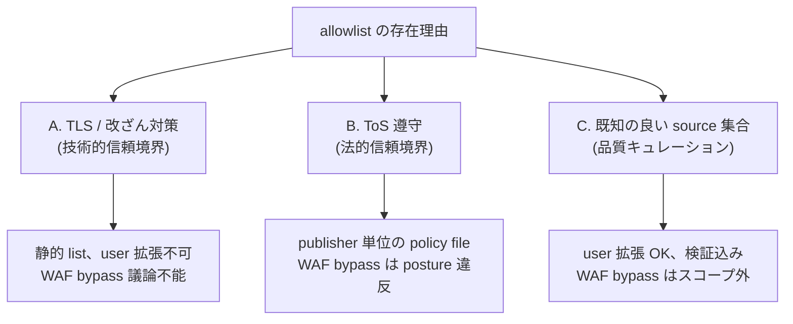

# 0028 - User-extensible capability gate; ToS + verified-curation posture; impersonation out-of-scope

- **Date:** 2026-05-21
- **Status:** Accepted (design; implementation slice tracked separately).
  This ADR sets the semantic frame for the redirect / fetch-host
  allowlist (the *capability gate*). It does not modify the default
  curated host set; that continues to live in
  `docs/REDIRECT_ALLOWLIST.md` §3 + `crates/doiget-core/src/http.rs`
  and is grown by individual ADRs per cluster (e.g. ADR-0027).
- **Supersedes:** -
- **Source:** #220 (user-extension request: Green-OA at `ruj.uj.edu.pl`);
  #223 (rejected: WAF / TLS-impersonation bypass);
  dogfood of finite-temperature-MPS corpus (2026-05-20).

## Context

The capability gate (`oa_publisher_allowlist()` /
`tier_2_allowlist()` + the redirect-allowlist enforcement in the
orchestrator) is the load-bearing primitive that keeps `doiget` a
**legitimate, auditable, official-channel** academic fetch tool
rather than a generic scraper. Until now its purpose has been only
*implicitly* defined — the codebase encodes "what" (a static list),
not "why" (the policy the list enforces).

Two recent issues exposed the absence of a stated policy:

1. **#220 (user-extension).** A real dogfood batch was blocked at
   `ruj.uj.edu.pl` (Jagiellonian University Repository — a Green-OA
   institutional repo). The user could not extend the allowlist
   locally without forking the codebase. The natural response —
   "let users add hosts via config" — has no documented constraint,
   so it could degrade into an arbitrary opt-out of the gate.
2. **#223 (impersonation).** A request for TLS-fingerprint
   impersonation (`reqwest-impersonate`) and cookie-import paths to
   bypass Cloudflare / Akamai WAF challenges on publisher hosts.
   Without a stated posture this would be a judgement call; with
   one, it is mechanically out of scope.

The ADR has to answer three questions: **why does the gate exist,
how may users widen it, and which proposals are mechanically
out-of-scope?**

### Three competing semantics for "why the gate exists"



`doiget` already enforces TLS-only at the transport layer
(`rustls-no-provider` + `ring`; ADR-0020 Am1), so the gate is **not
needed for TLS safety** — that is settled lower in the stack.
Interpretation A is therefore not load-bearing on its own. The gate's
real load is **B + C**: it filters to hosts that (1) permit automated
access under their terms and (2) have been empirically observed to
return well-formed PDFs in a doiget run.

## Decision

The capability gate is governed by the union of **ToS compliance
(B)** and **verified curation (C)**. This frame produces deterministic
answers to the three open questions:

### D1 — Default allowlist remains curated; entries require empirical evidence

`oa_publisher_allowlist()` and `tier_2_allowlist()` continue to grow
**only** through ADRs that:

1. Document the host (or single-suffix host pattern).
2. Cite ToS evidence that automated PDF fetch is permitted (e.g.
   APS green OA policy, SciPost diamond OA terms, arXiv API terms).
3. Cite at least one empirical fetch that produced a well-formed PDF
   with a sane `Content-Type` and an HTTP/2 200 (or 200 after a
   permitted redirect).

ADR-0027 is the canonical template for this growth path (the
empirical-evidence comment lives in `http.rs` next to each added
host). Hosts added without (1)+(2)+(3) are rejected.

### D2 — User-extensible allowlist via `config.toml`, opt-in, audited

Users SHALL be able to extend the gate for their own deployment via
`config.toml`, **literal hosts or single-suffix wildcards only**, and
each extension is recorded in the provenance log so the audit trail
remains intact:

```toml
[network]
contact_email = "researcher@institution.edu"

[[network.additional_hosts]]
host = "ruj.uj.edu.pl"
note = "Jagiellonian University Repository — Green OA (verified 2026-05-21)"

[[network.additional_hosts]]
host = "*.uj.edu.pl"
note = "all Jagiellonian subdomains; single-suffix wildcard"

# REJECTED at parse time:
# [[network.additional_hosts]]
# host = "*.edu.*"        # multi-segment glob — rejected
# host = "*"              # bare wildcard — rejected
# host = "user@host.com"  # not a host — rejected
```

Binding properties of the user-extension surface:

1. **Pattern grammar is restricted.** Literal host (`foo.example.org`)
   or single leading-segment wildcard (`*.example.org`, meaning
   "any subdomain of `example.org`"). Multi-segment globs (`*.edu.*`,
   `*.ac.*`), bare wildcards (`*`), and full glob (`*.example.*`) are
   parse errors. The orchestrator's pattern matcher is the same
   single-suffix logic ADR-0027 already uses (e.g. `*.aps.org`).
2. **Provenance log marks the path taken.** Every fetch that hit a
   user-added host MUST record `verified_by = "user"` in the
   provenance row (alongside the existing `safekey` / `canonical_digest`
   fields). Default-list fetches record `verified_by = "curated"`
   (or omit the field for backward compatibility — schema-additive).
3. **`doiget config doctor` surfaces extensions.** A `doctor` line
   reports the count of user-added hosts and warns that they are not
   part of the project-verified set. Names are NOT printed by default
   (privacy on shared logs); `--verbose` opts in.
4. **`doiget capabilities` reports the count, not the contents.** The
   `env_vars` / `docs` blocks already exist; a new field
   `capability_gate.user_extension_count` reports a non-negative
   integer. Field names are part of the wire format
   (`#[non_exhaustive]` discipline from #215).
5. **No env-var equivalent.** Extensions live only in
   `config.toml`. The reason: env vars are usually un-audited
   (CI scripts, parent processes); requiring a config file makes the
   extension a deliberate, reviewable artifact.

### D3 — Impersonation, WAF bypass, and credential-borrowing are out of scope

The gate's purpose includes the ToS-compliance leg (D1, point 2).
Proposals that route around publisher access controls
*by making automated requests appear human-driven* are mechanically
incompatible with that leg:

| Proposal (from #223) | Disposition |
|---|---|
| Detect Cloudflare / Akamai WAF blocks and surface as a structured `HttpError::BlockedByFirewall` variant | **Accept** — the detection itself is honest classification of a failure (not a bypass) and aligns with the structured-denial-context discipline of ADR-0023; tracked under Q6 / a future error-taxonomy ADR. |
| `reqwest-impersonate` / `rquest` (TLS JA3 fingerprint spoofing, HTTP/2 frame mimicry) | **Reject (out of scope; won't fix).** The crate's stated purpose is to misrepresent the client to publisher WAFs. This contradicts D1 point 2 directly. |
| `--cookies` flag importing user's authenticated browser session (Netscape `cookies.txt`) | **Reject for v0.4** (re-evaluate only on explicit maintainer review). Even if user-provided, the cookies represent the *user's* authenticated session being driven programmatically; many publisher ToS treat that as automated access by an unauthorized agent. The provenance / audit story is also unclear. |
| Embedded headless browser (`chromiumoxide`, `headless_chrome`, Playwright sidecar) | **Reject (permanent out of scope).** Brings a 100+MB Chromium dependency, an exec-arbitrary-JS execution surface, and is fundamentally an impersonation pipeline. Incompatible with the static-musl portability story (ADR-0020 Am1) and with the gate's ToS leg. |
| Per-host configurable `User-Agent` override (`network.user_agent`) | **Defer.** Setting a contact-bearing UA per `contact_email` policy (RFC compliance) is fine; setting a UA *to look like a browser* is impersonation. The current single-UA model honoring `contact_email` already covers the legitimate use case; a per-host UA table is reserved until a real legitimate need (e.g. publisher requiring a registered application UA) emerges. |
| Per-host configurable delay / cooldown (`network.cooldown_ms`) | **Accept** — separate, non-impersonating rate-limit tuning; tracked under #222, not blocked by this ADR. |

The `won't fix` items get a written response on their respective
issues citing this ADR; this is the canonical reference.

## Consequences

### Positive

1. The gate's purpose is now stated. Future allowlist-growth requests
   can be evaluated against D1; future impersonation requests can be
   declined against D3 without re-litigating the posture each time.
2. Real-world dogfood blockers like `ruj.uj.edu.pl` (#220) become
   solvable for the affected user in 30 seconds (edit `config.toml`)
   without forking, while keeping the default set verified.
3. `provenance.verified_by` provides the audit signal needed to
   distinguish "doiget vouched for this host" from "the operator
   accepted responsibility for this host" — important for
   institutional users.
4. The ADR makes #223 a one-comment close (link here) rather than
   a recurring design debate.

### Negative

1. The `config.toml` surface grows; the `additional_hosts` parser
   becomes a small but non-trivial new code path with its own
   tests (pattern validation, `verified_by` plumbing, doctor
   surfacing).
2. Users will sometimes add hosts that don't actually serve OA PDFs
   (legacy URLs, paywalled HTML, etc.). The fetch then fails with a
   *different* error code (`NETWORK_ERROR` / unexpected
   `Content-Type`) rather than `CAPABILITY_DENIED`; the failure
   digest must make this distinguishable.
3. The "single-suffix wildcard" rule is a usability compromise — a
   user who wants to whitelist three sibling subdomains of
   `example.org` must either list all three, or whitelist the parent
   suffix (which is broader than they may have intended). This is
   deliberate: the rule biases toward least-privilege per-host
   grants.
4. The `won't fix` posture for impersonation closes the door on a
   subset of real publishers (those that block all non-browser TLS
   fingerprints). doiget cannot reach those papers via automated
   official-channel fetch; the documented workflow there is *manual
   download → `doiget import <pdf>`* (a future facility tracked
   separately), not impersonation.

### Migration

- No default-list change. The implementation slice introduces the
  `network.additional_hosts` parser, the `verified_by` provenance
  field (schema-additive), the `doctor` line, and the
  `capabilities.capability_gate.user_extension_count` field.
  None of these break existing consumers.
- The `won't fix` issues (#223 items D3) get a maintainer comment
  pointing at this ADR and are closed with `state_reason: not_planned`.

## References

- `docs/REDIRECT_ALLOWLIST.md` §3 — the default curated host set
- ADR-0023 (structured `denial_context` on error envelopes; the
  failure-shape this ADR's `CAPABILITY_DENIED` continues to honor)
- ADR-0027 (allowlist-growth template; the canonical "add a host"
  procedure under D1)
- #220 (user-extension motivation)
- #223 (impersonation proposals; rejected under D3)
- #222 (`network.cooldown_ms` — separate, accepted)
