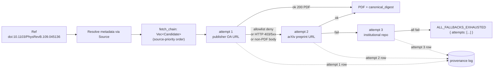

# 0029 - Fetch chain: per-Ref multi-attempt resolution with attempt-level provenance

- **Date:** 2026-05-21
- **Status:** Accepted (design; implementation slice tracked separately
  and gated by ADR-0028 — the chain composes with the curated +
  user-extension allowlist semantics, not around them).
- **Supersedes:** -
- **Source:** #222 (auto-preprint / alternative-OA fallback);
  dogfood of finite-temperature-MPS corpus where DOI-publisher
  fetches returned 403 but arXiv preprints were present in OpenAlex
  metadata.

## Context

The current fetch pipeline resolves a `Ref` (DOI / arXiv ID / PMID)
to **exactly one** PDF URL via the metadata source's *best* OA
location:

```text
Ref -> Source.lookup -> single URL -> fetch -> PDF | error
                       (best_oa_location)
```

This is wasteful in two directions:

1. **Wasted information.** OpenAlex returns *multiple*
   `oa_locations[]` per work (publisher OA, arXiv preprint, repo
   mirror, …). Today only the first is tried; if it fails, the
   remaining locations are discarded even though they're already in
   the metadata response.
2. **Wasted recovery.** In the dogfood batch, a `doi:` lookup hit
   `link.aps.org` and was blocked by a publisher WAF (HTTP 403). The
   *same* paper's arXiv preprint was already listed by OpenAlex with
   a valid, allowlisted URL. The user had to discover this manually
   and re-issue a separate fetch.

The natural fix is to **try the OA locations in priority order until
one succeeds**, and to record the chain in the provenance log so the
audit trail captures every external request, not just the final
outcome.

This ADR pins the chain semantics, the per-attempt provenance shape,
and the new closed-enum error variant for the "all attempts failed"
terminal state.

### Why this is not a CLI retry policy

A retry policy is a *temporal* loop ("try again after T") on the
*same* URL; a fetch chain is a *spatial* search across alternative
sources of the same logical paper. The two are orthogonal:

| | Retry policy | Fetch chain (this ADR) |
|---|---|---|
| Loop dimension | time | source / URL |
| Triggered by | transient error (5xx, timeout) | non-transient on a given URL |
| Cardinality of requests | 1 ref × N retries | 1 ref × N alternative sources |
| Authoritative shape | retry policy (host-level) | metadata source (`oa_locations[]` order) |

The chain belongs in `doiget-core` because every consumer of the
core API — CLI, MCP, future bindings — wants the same multi-source
search semantics. Putting it in `doiget-cli` as a retry policy would
duplicate it for every consumer and would make MCP tools weaker than
the CLI for no good reason (the #212 alignment ADR exists precisely
to prevent this kind of drift).

## Decision

### D1 — Chain lives in `doiget-core` as the canonical fetch primitive

The orchestrator's `fetch_one` function is generalized from
"resolve to one URL then fetch" to "resolve to an ordered chain of
candidate URLs and walk it until one succeeds." MCP tools and the
CLI both consume this new shape.



### D2 — Chain ordering is the metadata source's `oa_locations[]` order

In v0.4, doiget honors the order returned by the metadata source
(OpenAlex / Unpaywall) verbatim. Rationale:

- OpenAlex already encodes a quality ordering: `best_oa_location`
  first, then sorted by `location.is_oa` and version (published >
  accepted > submitted).
- The metadata source is the operator of the catalog, not doiget;
  imposing a *second* ordering layer in doiget adds policy that
  needs justification.
- User-configurable priority (e.g. `[fetch_chain] prefer = ["arxiv",
  "publisher_oa", "institutional"]`) is deferred until at least one
  empirical case shows the default ordering is wrong for legitimate
  workflows. This keeps v0.4 surface area minimal.

### D3 — Per-attempt rules — when to advance, when to stop

The chain advances on **retryable failures** and stops on
**terminal failures**:

| Outcome | Action |
|---|---|
| HTTP 200 with `Content-Type: application/pdf` (or sniffed PDF magic bytes) | **Success** — record the attempt as `ok`, stop the chain, return the PDF + canonical_digest. |
| HTTP 403 / 429 / 5xx | Advance to next candidate. (Honest WAF-block detection from a future taxonomy slice may yield a more specific code; the *chain* behavior is unchanged — still advances.) |
| HTTP 200 with non-PDF body (HTML challenge page, paywall splash) | Advance. The fetched body is discarded; provenance records the response shape. |
| `CAPABILITY_DENIED` (the host failed the allowlist gate from ADR-0028) | Advance. The denial is honest and structured (ADR-0023). |
| Network error (DNS / connect timeout / TLS) | Advance. |
| `INVALID_REF` at the metadata stage | **Terminal.** No candidates exist; chain never starts. |
| `RATE_LIMITED` (per-host cooldown enforced) | **Terminal for the chain** but the *ref* is queued for a future re-attempt (chain re-walks from candidate 1 on the next batch run; cache-hit logic from ADR-0023's content-addressed store ensures successful past attempts are not re-issued). |
| `STORE_ERROR` (disk / quota / permissions) | **Terminal.** Local failure, not a remote one; trying another remote candidate won't help. |

The advance/stop classification is a closed set; new outcomes added
in future ADRs must be classified explicitly.

### D4 — Per-attempt provenance — one log row per remote request

Every attempt is recorded in the provenance log as its own row, even
if a later attempt in the chain succeeds. This is a deliberate
expansion of "1 ref = 1 row" to "1 ref = N rows (one per attempt)"
under the existing hash-chained schema.

Row shape (schema-additive over the existing ADR-0024 v2):

```jsonc
{
  // Existing fields (unchanged)
  "v": 2,
  "ts": "2026-05-21T03:14:15Z",
  "ref": "doi:10.1103/PhysRevB.109.045136",
  "safekey": "doi-10.1103-PhysRevB.109.045136",
  "host": "link.aps.org",
  "outcome": "fetch_blocked",
  "code": "NETWORK_ERROR",
  "prev_hash": "…",
  "this_hash": "…",

  // New fields (ADR-0029 additive)
  "chain_attempt": 1,        // 1-based index of this attempt
  "chain_total":   3,        // total candidates in the chain at time of attempt
  "chain_terminal": false,   // true iff this attempt ended the chain (success or terminal-failure)
  "verified_by": "curated"   // from ADR-0028; tagged per-attempt because hosts differ
}
```

For a 3-attempt ref ending in success-on-attempt-2, the log carries
two rows: `chain_attempt = 1` is the publisher OA failure;
`chain_attempt = 2` is the arXiv success (`chain_terminal: true,
outcome: "ok"`). The chain stops at success — attempt 3 is never
issued and no row is written for it.

The hash chain is per-row as before; the relationship "these N rows
belong to the same Ref attempt" is reconstructed by readers from
`ref` + a monotonically increasing per-ref attempt counter (the
read-side helper is part of the implementation slice).

### D5 — New closed-enum error variant: `ALL_FALLBACKS_EXHAUSTED`

When every candidate in the chain has failed with an advancing
outcome, the orchestrator returns a structured error:

```rust
pub enum FetchErrorCode {
    // existing variants...
    AllFallbacksExhausted,
}

pub struct FetchError {
    pub code: FetchErrorCode,
    pub message: String,
    pub denial_context: Option<DenialContext>,  // ADR-0023, unchanged
    pub chain: Vec<AttemptOutcome>,             // new, ADR-0029
}

pub struct AttemptOutcome {
    pub source: String,           // e.g. "openalex.oa_locations[0]"
    pub url: String,
    pub code: FetchErrorCode,     // the *per-attempt* failure code
    pub status: Option<u16>,      // HTTP status if reached
    pub host: String,
}
```

The `chain` field is part of the wire format on the
`--mode json` / MCP / batch-JSONL surfaces (consistent with #212's
alignment goal). Renaming `AttemptOutcome` fields is a semver-minor
+ `[BREAKING]` callout, per the existing wire-stability discipline
(#208 self-review §1; `EntryInfo` / `MigrationReport` precedent).

### D6 — Allowlist and rate-limit composition

Each candidate URL passes through the ADR-0028 capability gate
*independently*. A user who has not extended the allowlist will see
candidates on institutional-repo hosts produce `CAPABILITY_DENIED`
and the chain will advance. A user who has added
`*.uj.edu.pl` to `additional_hosts` will see attempts on that host
succeed (modulo network), with `verified_by = "user"` recorded per
ADR-0028 D2-2.

Per-host rate-limit (`network.cooldown_ms` from #222, accepted under
ADR-0028 D3) applies per-attempt. A chain that walks three hosts
incurs three host-scoped cooldowns. The cooldown is not amortized
across the chain.

## Consequences

### Positive

1. The dogfood case (publisher WAF block → arXiv recovery) is
   handled automatically; no manual re-issue, no script glue.
2. The provenance log gains the resolution shown above — every
   external request is captured, enabling honest "we tried N hosts"
   answers in audits and post-mortems.
3. MCP and CLI gain the chain semantics together (#212 alignment is
   preserved by construction; the surface is the same shape).
4. Composes cleanly with ADR-0028: a user-extension that makes the
   institutional repo allowlist-pass is reflected per-attempt in
   `verified_by`.

### Negative

1. **Request multiplication.** A pathological ref hits every host
   in `oa_locations[]` before failing terminally. Worst-case
   per-ref cost rises from 1 request to `len(oa_locations[])`.
   In practice OpenAlex returns ~1-4 locations per work; the
   amplification is bounded.
2. **Provenance log volume grows.** Same factor as the request
   amplification. Log rotation (#140, already shipped) absorbs this,
   but the retention math changes — the implementation slice
   updates `docs/PROVENANCE_LOG.md` §6 accordingly.
3. **`oa_locations[0]` is no longer a contract.** Today a downstream
   consumer might (mistakenly) read only the first row per ref;
   under D4 that semantics is wrong — the first row may be a
   *failed* attempt and the final outcome row carries
   `chain_terminal: true`. The implementation slice documents the
   read-side helper and updates `MCP_TOOLS.md` §11.
4. **Wire-format surface grew.** `FetchError.chain` and
   `AttemptOutcome` are new public types; once shipped they are
   covered by the wire-stability discipline. This is intentional —
   the chain is a primitive, not an implementation detail.

### Migration

- v0.3 callers see no breaking change. The chain runs whenever
  `oa_locations[]` has ≥ 1 entry; a 1-entry chain is byte-equivalent
  to today's "single URL fetch" path.
- The provenance schema is additive: new fields (`chain_attempt`,
  `chain_total`, `chain_terminal`, `verified_by`) default to
  `1 / 1 / true / "curated"` for backward compatibility with v2 rows
  written before this slice. `doiget audit-log --verify` accepts
  both shapes.
- The new `ALL_FALLBACKS_EXHAUSTED` code is added to `ERRORS.md`'s
  closed set and to the `capabilities` JSON inventory's
  `subcommands[].errors[]` (the same #214 surface). MCP tool spec
  (`docs/MCP_TOOLS.md` §11) gets a matching update.

## References

- ADR-0023 (structured denial context; the `denial_context` per
  attempt continues to follow that shape)
- ADR-0024 (provenance log v2 schema; this ADR is schema-additive
  on top of v2, no v3 bump)
- ADR-0027 (curated host list — the source of "host is reachable
  under doiget's posture")
- ADR-0028 (the gate semantics this chain composes with;
  `verified_by` per attempt is from there)
- #210 (`fetch_one` outcome plumbing — the consumer-side wire
  surface this ADR's `AttemptOutcome` feeds into)
- #212 (MCP/CLI shape alignment — the principle that motivates
  putting the chain in core)
- #222 (auto-preprint fallback — the user-facing requirement)
