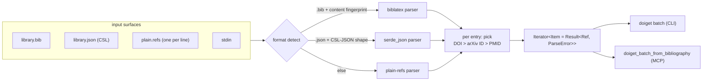

# 0030 - Bibliography input adapters (.bib / CSL-JSON) in doiget-core; new MCP tool `doiget_batch_from_bibliography`

- **Date:** 2026-05-21
- **Status:** Accepted (design; implementation slice tracked
  separately).
- **Supersedes:** -
- **Source:** #222 §2B (BibTeX / CSL-JSON batch input);
  Zotero-as-distribution-channel framing (maintainer review
  2026-05-20).

## Context

`doiget batch` today accepts only the plain-refs format: one
identifier per line in `doi:…` / `arxiv:…` / `pmid:…` shape. Real
researchers do not maintain such files — they export reference
libraries from Zotero / Mendeley / EndNote as **`.bib`** (BibLaTeX)
or **CSL-JSON**. The current friction is:

```text
Zotero library → export .bib → user writes custom regex parser
                            → grep/sed to extract DOIs
                            → pipe into doiget batch
```

Every researcher writes a different parser; mistakes silently drop
papers. This is exactly the kind of paper-cuts that prevents `doiget`
from being adopted via the Zotero distribution path discussed in the
2026-05-20 review (Zotero plugin → MCP server → doiget pipeline).

### Two related-but-distinct surfaces are being added

1. **CLI batch input**: `doiget batch library.bib` accepts a `.bib`
   file directly, replacing the user-written parser.
2. **MCP tool**: a new `doiget_batch_from_bibliography(path)` tool
   so a Zotero plugin (or any other MCP client) can hand a `.bib`
   file path to `doiget serve` and receive structured per-entry
   results, without shelling out.

Both consume the same parser. Choosing where that parser lives
(core vs cli) is the load-bearing decision in this ADR.

## Decision

### D1 — Parser lives in `doiget-core` as a new `refs::parse` module

The bibliography parser is a core capability, not a CLI affordance.
Putting it in `doiget-cli` would make the MCP tool (#212-aligned
with the CLI) weaker than the CLI for no good reason — a Zotero
plugin handing a `.bib` path to MCP would force the plugin author
to either re-implement BibTeX parsing in JavaScript (the
distribution path's whole point is to avoid this) or shell out to
the CLI just for the parser (which negates the structural advantage
of MCP).



### D2 — Dependency: `biblatex` crate, enabled by default

The parser adds the `biblatex` crate (~500 KB compiled) to
`doiget-core`. It is enabled in the **default feature set**, not
behind an opt-in flag. Reasoning:

- The musl-static release binary currently weighs ~10 MB; +500 KB is
  a 5 % footprint increase, which is acceptable.
- Putting it behind a feature flag would mean the default
  `cargo install doiget-cli` lacks `.bib` support — exactly the
  friction this ADR exists to remove.
- A lean `oa-only-no-bib` minimal build can still be produced by
  consumers via `default-features = false`; the `biblatex` dep
  joins the feature graph that already includes `oa-only`.

CSL-JSON is parsed via the existing `serde_json` (no new
dependency).

### D3 — One entry produces one `Ref`; priority is DOI > arXiv ID > PMID

A single bibliography entry may carry multiple identifiers:

```bibtex
@article{example2024,
  author = {…},
  title  = {…},
  doi    = {10.1103/PhysRevB.109.045136},
  eprint = {2204.12345},          % arXiv
  pmid   = {12345678},
  url    = {https://link.aps.org/…}
}
```

The parser picks **one** identifier per entry, in priority order:

1. `doi` field (or `doi` in `note`, recognised by the
   `^doi:\s*(.+)$` shape used by Zotero exports);
2. `eprint` + (`archiveprefix = "arXiv"` OR `eprinttype = "arxiv"`)
   → `arxiv:<id>`;
3. `pmid` field → `pmid:<id>`.

Entries with none of the above yield a `ParseError::NoIdentifier`
which is **skipped + counted** in the default mode and **aborts** in
`--strict`. The skip is reported in human-mode stderr and as a
JSONL parse-error record in `--mode json` (consistent with #205's
batch JSONL shape).

The "pick one" rule prevents accidental N-fold fetch
amplification — fetching the publisher OA, the arXiv preprint, AND
the PMID record for the same paper would triple-charge rate limits
and produce three near-duplicate store entries. The fetch chain
(ADR-0029) already handles the "publisher OA failed → fall back to
arXiv" recovery path *within* the resolution of a single Ref; the
adapter does not need to fan out.

### D4 — Format auto-detection by extension, overridable

Detection precedence:

1. **`--format` CLI flag** if given (`bibtex` / `csl-json` / `refs`).
2. **File extension** if reading from a path: `.bib` / `.biblatex`
   → `bibtex`; `.json` / `.yaml` / `.csl` → `csl-json`; otherwise
   `refs`.
3. **Content fingerprint** for stdin or unknown extensions: peek
   the first non-blank line and test for `@<entrytype>{` (BibTeX),
   `[` followed by `{"id":` or `"DOI":` (CSL-JSON), or
   `^[a-z]+:` (plain refs).
4. **Fallback**: `refs`. On the very first parse failure, emit a
   helpful error message naming the detected format and suggesting
   `--format` overrides.

### D5 — Parse-error policy: skip + warn by default; `--strict` aborts

Real-world `.bib` files have one in every couple-dozen entries that
fails to parse (escaping issues, encoding, exotic BibLaTeX
extensions). Aborting the whole batch on the first parse error is
hostile to the actual user workflow.

- Default mode: parse errors yield a stderr warning + a counted
  `parse_errors` summary at end of batch + are recorded in the
  per-ref JSONL stream (`{"ok": false, "ref": null,
  "error": {"code": "INVALID_REF", "message": "...", "entry_key":
  "example2024"}}`).
- `--strict` mode: the first parse error aborts; existing successes
  are flushed.

The `entry_key` field carries the BibTeX citation key (or CSL `id`)
so the operator can locate the offending entry in their library.

### D6 — New MCP tool: `doiget_batch_from_bibliography`

```jsonc
// Tool spec sketch — full schema lands in docs/MCP_TOOLS.md §N
{
  "name": "doiget_batch_from_bibliography",
  "description": "Parse a BibTeX/.bib or CSL-JSON file and fetch each entry. Returns one structured outcome per resolvable entry.",
  "inputSchema": {
    "type": "object",
    "properties": {
      "path":   { "type": "string", "description": "Absolute path to .bib or CSL-JSON file" },
      "format": { "type": "string", "enum": ["auto", "bibtex", "csl-json"], "default": "auto" },
      "strict": { "type": "boolean", "default": false }
    },
    "required": ["path"]
  },
  "outputShape": {
    "summary": { "total": "int", "ok": "int", "failed": "int", "parse_errors": "int" },
    "entries": [
      { "ok": true,  "ref": "...", "entry_key": "...", "result": { /* AttemptOutcome.chain final, ADR-0029 */ } },
      { "ok": false, "ref": "...", "entry_key": "...", "error":  { "code": "...", "message": "...", "chain": [...] } },
      { "ok": false, "ref": null,  "entry_key": "...", "error":  { "code": "INVALID_REF", "message": "no identifier" } }
    ]
  }
}
```

The tool's structured output mirrors `batch --mode json` per
ADR-0029 D5 / #212 alignment — same `AttemptOutcome.chain`, same
`FetchError` shape, plus an `entry_key` to bridge back to the
operator's library entry. A Zotero plugin can use `entry_key` to
update the right reference with the fetched PDF.

### D7 — CLI surface: `doiget batch library.bib` (no separate subcommand)

The CLI extension is *not* a new subcommand. `doiget batch <input>`
already takes one positional argument; the parser detects the
format. Adding `doiget batch-bibliography` would be a redundant
subcommand whose only difference from `batch` is the parser — and
the parser is what's now in core. The CLI command stays single.

`--format` is a new global / subcommand flag introduced alongside;
it is mutually compatible with the `--store-root` / `--log-path` /
`--color` / `--progress` set being added under #211 (independent
slice).

## Consequences

### Positive

1. The Zotero distribution path's structural friction (every user
   writes their own parser) is removed. The MCP tool unblocks the
   Zotero-plugin design discussed in the maintainer review on
   2026-05-20.
2. `.bib` and CSL-JSON ingestion lives next to the actual fetch
   pipeline; the per-entry path through #205 batch JSONL is the
   same regardless of input shape — only the head of the pipeline
   differs.
3. `entry_key` is the missing link for downstream "write the fetched
   PDF back into Zotero / Mendeley" automations.

### Negative

1. **+500 KB on the default binary.** The musl-static release grows
   from ~10 MB to ~10.5 MB. Acceptable but worth recording.
2. **Parser bug surface.** `biblatex` is a third-party crate that
   has known rough edges with exotic BibLaTeX usage (e.g.,
   `@string` macros, custom field syntaxes). The skip-and-warn
   policy means *some* of these surface as warnings, not panics;
   the implementation slice ships a corpus of "weird `.bib`" cases
   in the test suite.
3. **Identifier-picking ambiguity.** A `.bib` entry without DOI but
   with both `eprint` (arXiv) and `url` (a publisher link) is
   resolved to the arXiv id — never the URL — because URLs are not
   in the priority list. A subset of users may consider this
   surprising; the priority list is documented in `docs/CONFIG.md`
   and surfaced via `doiget capabilities` (the inventory JSON gains
   a `bibliography_identifier_priority` field).
4. **No fan-out by design.** Power users wanting "fetch DOI AND
   arXiv version" cannot get it through the adapter. The documented
   workflow is to ship the same entry twice through the plain-refs
   pipe; ADR-0029's chain already does what they probably actually
   wanted.

### Migration

- v0.3 callers (plain refs) are unaffected: the auto-detection
  falls through to the `refs` parser on stdin / unrecognised
  extensions.
- `--format` flag is additive; missing flag means `auto`.
- `docs/MCP_TOOLS.md` gains the new tool section; the `mcp_tools`
  array in `doiget capabilities` JSON (#214 surface) gains the
  `doiget_batch_from_bibliography` entry.
- `docs/CONFIG.md` §5 documents the new
  `bibliography_identifier_priority` (currently a hard-coded list,
  may be made user-configurable in a later slice if demand exists).

## References

- ADR-0029 (the fetch chain; the `batch_from_bibliography` per-entry
  output is exactly the chain's `AttemptOutcome`)
- ADR-0024 (`Ref` canonical form — what the parser must produce)
- #205 (batch JSONL shape; this ADR's adapter feeds the same shape)
- #210 (`fetch_one` outcome plumbing; the per-entry `result` field
  is the same plumbing's output)
- #212 (MCP/CLI alignment — the principle that motivates putting
  the parser in core and exposing both the CLI and MCP tool)
- #214 (`capabilities` inventory; this ADR adds a tool and a
  priority-list field to that inventory)
- #222 (the user-facing motivation)
- 2026-05-20 maintainer review (Zotero distribution path framing)
