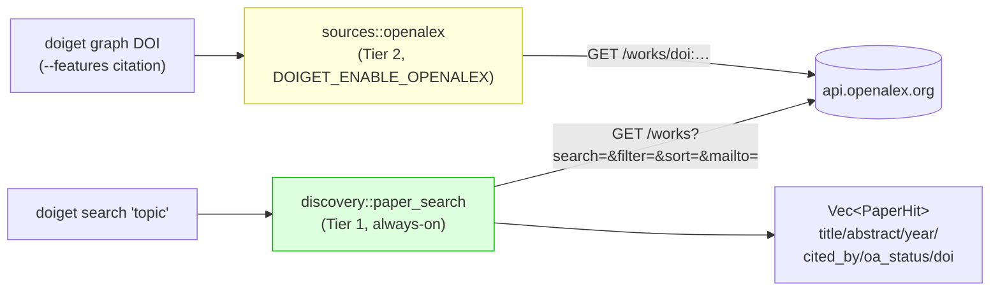

# 0031 - Discovery search is Tier-1 OA metadata (always-on); `doiget search` defaults to external discovery

- **Date:** 2026-06-05
- **Status:** Accepted (design; implementation slice tracked
  separately).
- **Supersedes:** -
- **Amends:** `docs/CAPABILITY.md` tier classification (adds a
  discovery-search capability to the always-on Tier 1 surface) and
  `docs/SOURCES.md` §4 (OpenAlex is now consulted by two distinct
  call paths with different tiers — see D4).
- **Source:** #281 (agent-driven literature discovery — `search →
  triage → expand → fetch → read → map`); maintainer feasibility
  read #281 (comment 2026-06-04).

## Context

`doiget` excels at the *back half* of the research loop
(`fetch`/`batch`/`graph`/`bib`/`csl`/`serve`) but the *front half* —
turning a topic into candidate papers — is missing. `doiget search`
today is a **local-store-only** substring scan (`FsStore::search`):
it can only re-find papers already in the store, never discover new
ones. The discovery half of #281 needs a `topic → candidate papers`
query against an external index.

OpenAlex is the obvious backbone: free, no auth, abstracts via the
inverted index, the same host the citation `graph` already uses. The
problem is **where this lands in the capability model**.

### The collision with the shipped binary

The released binary is built `--no-default-features --features
oa-only` (`release-plz.yml`, `release-sign.yml`). Under the current
`docs/CAPABILITY.md` tier split, OpenAlex is **Tier 2 (`metadata`)**:

- **compile-time** gated behind the `metadata` Cargo feature
  (`sources/mod.rs` `#[cfg(feature = "metadata")]`), and
- **runtime** gated behind `DOIGET_ENABLE_OPENALEX`.

So the shipped binary contains *no* OpenAlex code at all, and even a
`--features metadata` build still requires an env var to opt in.
Making `doiget search` default to external discovery — the headline
value of #281, "type a topic, get interesting papers" — would be a
no-op (or a hard error) in the very binary users install.

### Why the Tier-2 placement does not fit discovery search

The Tier-1/Tier-2 line is about **network-surface risk**, not about
"OA vs not". Tier 1 (`oa` = AlwaysOn) already makes external
metadata API calls on every fetch: **Crossref** and **Unpaywall**
are hit for bibliographic metadata + OA-location resolution without
any env gate. A single bounded OpenAlex `/works?search=` query is
the same risk class as those: read-only, OA metadata, never touches
a paywall, never downloads a PDF.

OpenAlex was placed in Tier 2 because its *original* use — the
citation `graph` BFS — walks `referenced_works[]` and can amplify
into many requests (bounded by the ADR-0010 hard caps, but still a
fan-out), and as "enrichment" it is not required to fetch a paper
the user already named by DOI. Discovery search has neither
property: it is a single query the user explicitly asked for.

## Decision

### D1 — Discovery search is a Tier-1, always-on capability

The OpenAlex `/works?search=` call path is classified as **Tier 1 OA
metadata**: always permitted, **no `DOIGET_ENABLE_OPENALEX` gate**,
same posture class as Crossref/Unpaywall. The justification is the
network-surface argument above: it is read-only OA metadata, a single
bounded request, never paywalled, never a PDF.

`docs/CAPABILITY.md` §5 startup banner reflects this implicitly — no
new env var is added. `doiget capabilities` continues to derive its
subcommand inventory from the clap AST, so the new `search` flags
appear automatically.

### D2 — Discovery search ships in the default `oa-only` binary

The implementation lives in a **new, always-compiled** core module
`doiget_core::discovery` (no `#[cfg]`), and a new always-compiled
`http::discovery_allowlist()` registers `api.openalex.org` under the
`"openalex"` source key. The CLI's `build_http_client` extends the
production allowlist with `discovery_allowlist()` **unconditionally**;
the existing `#[cfg(feature = "citation")] tier_2_allowlist()` still
runs in citation builds and re-registers the same host under the same
key (an idempotent `HashMap` overwrite — harmless).

Result: the shipped `oa-only` binary can run `doiget search <topic>`
out of the box.

### D3 — Discovery search is metadata-only and never a PDF leg

`paper_search` returns structured `PaperHit` records
(`doi`/`title`/`authors`/`year`/`venue`/`abstract`/`cited_by_count`/
`oa_status`) reconstructed from the OpenAlex Work record (the
abstract is rebuilt from `abstract_inverted_index`). It calls
`HttpClient::fetch_bytes` (JSON), **never** `fetch_pdf`, and never
follows an OA URL. Triage completes entirely on open metadata,
outside any paywall — consistent with the repo ethos (#281
"Non-goals: never bypass paywalls").

### D4 — Two OpenAlex call paths, two tiers (kept distinct)

OpenAlex is now consulted by two separate code paths with
**different** capability tiers, and this is intentional:

| Path | Module | Tier | Gate |
|---|---|---|---|
| Discovery search (`/works?search=`) | `discovery` (always) | **1** | none |
| Enrichment / citation graph (`/works/doi:…`, `referenced_works[]`) | `sources::openalex` (`#[cfg(metadata)]`) | **2** | `DOIGET_ENABLE_OPENALEX` + `--features citation` |

The `OpenalexSource` (Tier 2) is unchanged. Discovery does not
reuse it (the `Source` trait is `ref → FetchResult`; search is
`query → list`), so there is no entanglement: a clean free function
in `discovery` reusing only the shared `HttpClient` + rate limiter +
provenance log.

### D5 — `doiget search` defaults to external discovery (`--local` for the store)

The CLI surface flips:

- `doiget search <query>` → **external discovery** (default).
- `doiget search <query> --local` → the legacy local-store scan
  (`FsStore::search`), behaviour-preserving.
- `--external` is accepted as the explicit form of the default;
  `--local` and `--external` are mutually exclusive.

This is a **`[BREAKING]` behaviour change** to `search` (the default
output changes from local store rows to external candidates). It is
acceptable in the 0.x line and is called out in `CHANGELOG.md`. The
two scopes share one envelope under `--mode json`:
`{ "scope": "external" | "local", "query": "...", "results": [...] }`
where the `results[]` element schema is scope-dependent (documented
alongside the change). Distinguishing the two by `scope` keeps an
agent from having to guess which shape it received.

PR1 ships the filter set `--limit`, `--from-year` / `--to-year`,
`--oa-only`, `--min-citations`, `--sort relevance|cited|recent`, and the
**name-resolved** entity filters `--author` / `--venue` / `--publisher`.
OpenAlex filters authors / sources / publishers by entity ID, not free
text, so each name is first resolved to its OpenAlex ID via a
`?search=` lookup (`/authors`, `/sources`, `/publishers`; top hit) and
then applied as `authorships.author.id` /
`primary_location.source.id` / `primary_location.source.publisher_lineage`.
A name that resolves to nothing is a typed `FetchError::NotFound` — the
filter is never silently dropped. The `survey` macro stays out of scope
(the maintainer feasibility read warns against a mega-command; thin
primitives first).

### D6 — MCP exposure is a separate slice

`doiget_paper_search` (and renaming the local search tool to
`doiget_search_local`) is **not** in this PR — it lands in the
follow-up MCP slice (#281 item 2, #212-aligned). This ADR governs
the core capability + CLI surface only.

## Consequences

### Positive

1. The shipped `oa-only` binary gains real discovery: `doiget search
   <topic>` returns abstract-bearing candidates ranked by relevance
   / citations / recency — the front half of the #281 loop, out of
   the box, no env var.
2. No new env var, no new compile feature for the common case; the
   capability model gains one clearly-justified always-on entry
   instead of dragging all of Tier 2 (S2/DOAJ/graph) into the
   default binary.
3. The Tier-2 `OpenalexSource` / `graph` posture is untouched;
   fan-out-amplifying paths stay opt-in.

### Negative

1. **Behaviour break on `search`.** Scripts relying on
   `doiget search foo` meaning "scan my store" must add `--local`.
   Mitigated by the 0.x semver latitude + CHANGELOG `[BREAKING]`.
2. **A default-binary network call users may not expect.** Typing a
   topic now hits `api.openalex.org`. This is the same class of call
   Crossref/Unpaywall already make on every fetch, and it is
   strictly metadata, but it does widen what the *idle* `search`
   subcommand does versus today (which was offline). Documented in
   the subcommand help + CAPABILITY.md note.
3. **Two OpenAlex paths to keep coherent.** D4's split means a future
   maintainer must remember that discovery is Tier 1 while
   enrichment is Tier 2. The table above + the module docs are the
   guardrail.

### Migration

- Add `--local` to any `doiget search` invocation that meant the
  store scan.
- `--mode json` consumers: read `scope` and branch on the
  `results[]` element schema; the local-scope element is the legacy
  `EntryInfo` shape, unchanged.
- No env-var migration: discovery needs none.

## References

- #281 (discovery loop; this ADR is the `paper_search` core + CLI
  slice)
- ADR-0010 (citation-graph hard caps — why the *graph* fan-out is
  Tier 2 and discovery search is not)
- ADR-0017 (output-mode resolution — the `--mode json` envelope)
- ADR-0027 / `docs/REDIRECT_ALLOWLIST.md` (the allowlist mechanism
  `discovery_allowlist()` plugs into)
- `docs/CAPABILITY.md` (the tier model this ADR amends)
- `docs/SOURCES.md` §4 (OpenAlex polite-pool / metadata-only
  contract)
