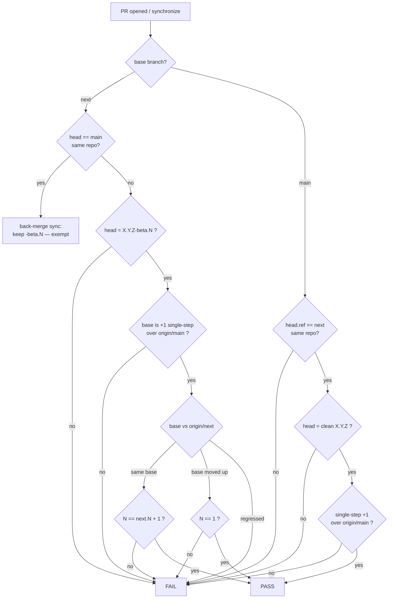

# 0033 - Per-PR version-bump enforcement + strict next→main promotion

- **Date:** 2026-06-24
- **Status:** Accepted — implemented by `chore/version-bump-gate`; promoted in
  0.8.0 (#352).
- **Amends:** [0025](0025-tag-driven-release.md) §D6 — adds a per-PR cadence to
  rule 2 and **retires rule 4's direct-to-`main` hotfix** path. Complements
  ADR-0025 Amendment 6 (advisory `version-check`); the tag-time gate (D2) and
  lanes (D3) are unchanged.
- **Source:** maintainer release-hygiene review, 2026-06-24 (the "where did
  0.7.1 go?" incident).

## Context

ADR-0025 made the **tag** the release and added a mandatory tag-time version
gate (D2, `scripts/release-version-gate.sh`). D6 rule 2 states the *invariant*
that `next` always carries `X.Y.Z-beta.N`, but nothing specified — or enforced —
how that version **advances per PR**. Two real gaps followed:

1. **No per-PR cadence.** On 2026-06-20 three PRs landed on `next` and the
   version was hand-bumped with no rule: `#327 → 0.7.1-beta.0`,
   `#325 → 0.7.2-beta.0` (the patch base also rolled), `#322 → 0.7.2-beta.1`
   (only the counter). A stable `0.7.1` was never cut; the number simply
   vanished into a pre-release that was overwritten.
2. **No PR-time guard.** The tag gate runs only on a pushed tag; `version-check`
   (Amendment 6) is advisory and compares against crates.io, which has **no
   published betas** — so two PRs could carry the *same* `…-beta.1` and both
   pass. Nothing forced a PR to advance beyond the previous PR's version.

A third, structural problem fell out of (1): `next` ended at base `0.7.2`, which
is a **+2 patch *skip*** over the `0.7.0` stable — not a clean single step, i.e.
not promotable under any "increment by one" rule. The version line had drifted
into a state that could not be released cleanly.

The maintainer's requirement: make version management **mechanical, gap-free,
and strict** — every PR advances the version by a defined amount, `main` only
ever moves by a clean promotion from `next`, and the stable line never skips a
number. **No labels, no exceptions.**

## Decision

A new **PR-time** enforcement layer — distinct from the tag-time gate (D2) and
the advisory `version-check` — implemented as `scripts/version-bump-gate.sh`
(one source of truth) run by `.github/workflows/version-bump.yml`, designed to
be a **required status check** on `next` and `main`.

### D1 — Strict per-PR cadence on `next`

Every PR to `next` MUST set `[workspace.package].version` to `X.Y.Z-beta.N`
that is strictly greater than `origin/next`, and:

- **same base** `X.Y.Z`: `N == origin/next.N + 1` (exactly +1 — no holds, no
  skips). This serialises `next`: a PR that goes stale behind a newer merge must
  re-bump, so no two merges ever share a `-beta.N`.
- **base change** (a *retarget*, D2): the counter resets to `-beta.1`.

### D2 — `next` base is always promotable

In *all* cases the base `X.Y.Z` MUST be a **+1 single-component step**
(`patch+1`, `minor+1`, or `major+1`, with the lower components zeroed) over the
**current stable** (`origin/main`). This keeps `next` continuously promotable
and **forces a retarget after every promotion** (immediately after a release,
`next`'s base equals the just-published stable and is therefore *not* a step —
the first post-promotion PR must retarget). A retarget is an ordinary PR that
moves the base up to another valid step; it needs no label because the math
fully constrains the legal targets.

### D3 — `main` is promotion-only; direct-to-`main` hotfix is retired

A PR to `main` MUST have head branch `next` **of this repository** (no fork
PRs, no other branches). This **retires ADR-0025 §D6 rule 4** (urgent stable
fix committed directly to `main`): under this ADR a hotfix is a normal `next`
PR followed by a promotion. The cost is that a hotfix ships with whatever else
is on `next`; the benefit (and intent) is the invariant **"`next` is always in
a releasable state"** — there is no second integration path to keep coherent.

### D4 — Promotion is a single +1 step; the stable line never skips

A promotion's version MUST be a **clean `X.Y.Z`** (no pre-release identifier)
that is exactly a +1 single-component step over `origin/main`. This is why the
active cycle is **retargeted `0.7.2-beta.1 → 0.8.0-beta.1`**: `0.7.0 → 0.7.2`
is a forbidden +2 patch skip, whereas `0.7.0 → 0.8.0` is a valid `minor+1`
(and the cycle's new commands warrant a minor under the 0.x policy). No
`0.7.1`/`0.7.2` was ever published, so the renumber drops nothing.

### D5 — Exactly one structural carve-out: the back-merge

The automated `main → next` back-merge PR (ADR-0025 Amendment 3, post-promotion
sync) intentionally **keeps** `next`'s `-beta.N` and so does not "advance" the
version. The gate exempts it, recognising it by **branch shape** (head is the
canonical `main`, same repo) — **not a label**. There are no label-based
exceptions of any kind.

### D6 — Enforcement layering (three distinct gates)

| Layer | When | Blocking? | Question |
| --- | --- | --- | --- |
| `version-bump-gate.sh` (this ADR) | PR open/sync | **yes** (required check) | did this PR advance the version per the lane cadence? |
| `version-check.yml` (0025 Amend. 6) | PR + push | no (advisory) | would tagging the current version release? |
| `release-version-gate.sh` (0025 D2) | pushed tag | yes (pre-publish) | is THIS tag releasable? |

`version-check` stays advisory (it is *designed* to be red on `main` between
releases and so can never be required). The tag gate is unchanged. Marking the
`version-bump` check **required** on `next` and `main` is a branch-protection
action performed by the maintainer (outside this repo's files).

### D7 — First application

This ADR's PR retargets `next` `0.7.2-beta.1 → 0.8.0-beta.1`, leaving the lane
in a promotable state (`0.7.0 → 0.8.0` = `minor+1`) and exercising the new gate
on its own change (a base retarget with the counter reset to `-beta.1`).

## Consequences

**Positive.** The version line becomes gap-free and monotone; a `0.7.1`-class
vanishing is structurally impossible. `next` is provably promotable at all
times. Release readiness is enforced by CI, not by maintainer discipline.
Two PRs can no longer collide on a `-beta.N`.

**Negative / cost.** A stable hotfix can no longer be isolated on `main`; it
ships through `next` with whatever else is queued there (mitigation: keep `next`
releasable — which is now the enforced norm). After every promotion the first
`next` PR must retarget the base before any further beta (the gate says so
loudly with the allowed targets). The maintainer must add the `version-bump`
check to branch protection for the gate to actually block.

**Governance.** On merge: flip this ADR to `Accepted` (note the PR), update the
`0033` row and the `0025` annotation in `DECISIONS/INDEX.md`. To revise this
decision, write a new ADR with `Supersedes: 0033` per `CONTRIBUTING.md`.
