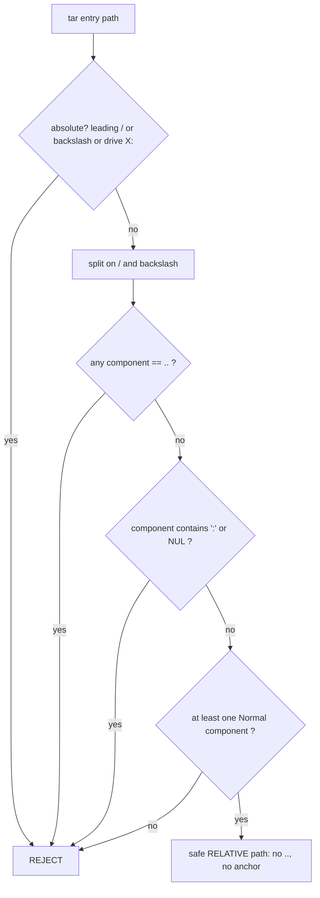

# 0034 - arXiv source bundle + individual figure download

- **Date:** 2026-06-24
- **Status:** Proposed — implemented by `feat/343-source-bundle-figures`
  (issue #343); flips to `Accepted` on merge per `DECISIONS/INDEX.md`
  conventions.
- **Relates:** extends the arXiv `/src/` capability introduced with
  `tex-source` ([ADR-0032](0032-fulltext-html-extraction.md) D1/D2). Bounded by
  [`SCOPE.md`](../SCOPE.md) §non-goal 1 (PDF-blob processing), 3 (no
  redistribution), 9 (no bulk download).
- **Source:** dogfooding 2026-06-24 (issue #343).

## Context

`doiget tex-source <arxiv-id>` fetches the arXiv source tarball
(`export.arxiv.org/src/<id>`) but extracts **only the single main `.tex`
file's text** (`extract_from_tar` reads only `*.tex` entries; everything else
is discarded). The original intent for the source capability is broader: let an
agent / user obtain (a) the **full source bundle** — every file in the
submission — and (b) **individual figures** — the image artifacts only.

Both are **already inside the bytes** `paper_tex_source` downloads, gunzips, and
untars; they are currently thrown away. So this adds no network surface: the
single `/src/<id>` request already happens.

This is new functionality beyond the enumerated SCOPE.md scope, so per SCOPE.md
it requires an ADR. It is **not** a permanent non-goal:

| SCOPE non-goal | Why this is clear of it |
| --- | --- |
| #1 PDF-blob content **processing** | Figures come from the **author-uploaded source tarball**, written **opaque** (bytes → disk). Never parsed / OCR'd / interpreted; never extracted from the compiled PDF. Same posture as ADR-0032 D1 ("a separate structured artifact; the PDF blob is never read"). |
| #9 No bulk download | One paper, from the **single `/src/` fetch already performed**. No new per-file requests; the rate limiter is untouched. |
| #3 No redistribution | Local store / user-given directory only, like PDFs. |

## Decision

### D1 — Capability + tier

Add an arXiv **source-bundle** capability: fetch the `/src/<id>` tarball and
materialise its files to a user-given directory, either the full bundle or
figures only. **Tier-1 OA, always-on** (same posture as `tex-source` /
ADR-0032 D2): no env gate, no Cargo feature gate.

### D2 — Artifact, never processing

Every extracted file is written **byte-for-byte opaque**. doiget does not parse,
convert, transcode, OCR, or otherwise interpret any extracted file (including
figures that happen to be `.pdf` — a vector figure is saved opaque exactly like
the main PDF). This keeps the feature on the ADR-0032-D1 / SCOPE-#1 side of the
line: fetching artifacts, not processing PDF-blob content.

### D3 — Path safety is a hard requirement (zip-slip)

Writing files extracted from an untrusted archive is a path-traversal
("zip-slip") surface. A single sanitiser, `sanitize_entry_path`, is the gate:

It returns only **relative** paths with no `..` and no root/drive anchor, so the
caller's `out_dir.join(path)` can never escape `out_dir`. Additional hardening:
**non-regular tar entries (symlinks / hardlinks / devices) are skipped** (a
symlink is itself a traversal vector), and the writer re-checks
`dest.starts_with(out_dir)` as defence-in-depth. `sanitize_entry_path` is a
pure function with an attack-vector-enumerating unit-test suite (absolute,
`..`, `a/../b`, `C:\`, backslash traversal, NUL, empty) — that suite is the
verification surface for this requirement.

### D4 — Surface (issue #343 decisions)

1. **New `doiget source <id> --out <dir> [--figures-only]`**, keeping
   `tex-source` text-only. `tex-source` is an agent-facing stdout-text verb;
   materialising files to disk is a different output model, so a separate
   command is cleaner than overloading flags.
2. **CLI-only for v1** — no MCP tool yet. MCP tools return structured data /
   paths; dumping a directory of many files does not fit that, and
   filesystem-materialising ops are CLI-first (cf. SCOPE #15 delete-is-CLI-only).
   Revisit if an agent need is shown.
3. **Output via an explicit required `--out <dir>`, decoupled from the store.**
   The store layout is BiblioFetch.jl-bit-compatible (STORE.md); injecting a
   source directory risks that contract. A later opt-in `<store>/<safekey>/src/`
   is a separate decision.
4. **Figures by extension allowlist:** `.pdf .eps .ps .png .jpg .jpeg .gif
   .svg` (case-insensitive). Conservative and contract-clear.

### D5 — No bundle cache (v1)

`tex-source` caches only the extracted main-`.tex` JSON. The raw tarball is not
cached; `source` re-fetches `/src/` per invocation (one request). A tarball
cache is a future optimisation, intentionally out of scope here.

### D6 — `tex-source` text path is unchanged

`extract_tex` / `extract_from_tar` (the best-`.tex` text selection) are left
**byte-identical**. The bundle path is a parallel `extract_bundle`; any later
de-duplication of the shared gunzip/untar prologue is a separate refactor.

## Consequences

**Positive.** Closes the original source-capability intent (full bundle +
figures) at zero added network. Unblocks part of #344 item 2 (the `.bib` in the
bundle is a citation-resolution input). Path-safety is centralised and
unit-tested.

**Negative / cost.** A second extraction path duplicates the gunzip/untar
prologue (D6) until a future refactor. No bundle cache means repeated `source`
calls re-fetch (one request each). MCP parity deferred (D4.2).

**Governance.** On merge: flip to `Accepted` (note the PR), add the `0034` row
to `DECISIONS/INDEX.md`. To revise, write a new ADR with `Supersedes: 0034`.
