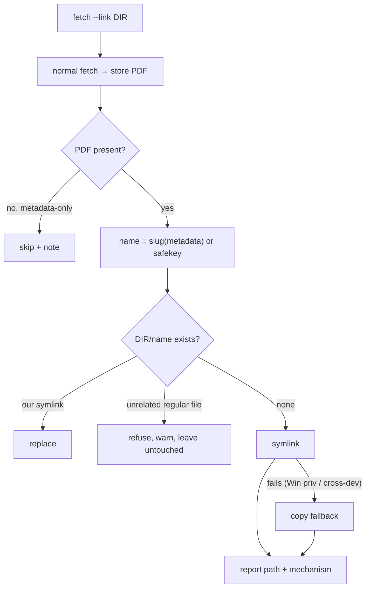

# 0035 - `fetch --link`: surface fetched artifacts into the working tree

- **Date:** 2026-06-24
- **Status:** Proposed — implemented by `feat/344-fetch-link` (issue #344
  Slice 2); flips to `Accepted` on merge per `DECISIONS/INDEX.md` conventions.
- **Relates:** issue #344 (agent-driven UX) problem 1 (store locality). Bounded
  by [`SCOPE.md`](../SCOPE.md) §non-goal 3 (no redistribution / share-vault).
- **Source:** dogfooding 2026-06-24 (#344).

## Context

doiget fetches into a single central store (`~/papers/<safekey>.pdf`,
[`STORE.md`](../STORE.md)). When an LLM agent drives doiget, the human is
usually working somewhere else — a project dir, an Obsidian vault — and **cannot
see what the agent just pulled**: the artifact lives "elsewhere" and never
surfaces where the work happens (#344 problem 1).

This is new CLI surface, so per SCOPE.md it needs an ADR. It is **not** a
permanent non-goal: §non-goal 3 forbids redistribution / a cross-**user**
share-vault; placing a link for the **same user** in their own working tree is
local visibility, not redistribution.

## Decision

Add `doiget fetch <ref> --link <dir>`: after a successful fetch, place a link to
the stored PDF in `<dir>` (created if missing).

### D1 — The store stays the single source of truth

`--link` adds a **pointer** (symlink), never a second canonical copy. Where
symlinks are unavailable (Windows without privilege, cross-device) it falls back
to a **copy** and says which it used. The store entry is unchanged.

### D2 — Readable, filesystem-safe name

The link is named from the (already-resolved, #344 Slice 1) metadata —
`<surname><year>-<title-slug>.pdf`
(e.g. `vaswani2017-attention-is-all-you-need.pdf`) — because the whole point is
human visibility; a `safekey`-named file is barely more legible than the store.
The slug is lowercase ASCII-alphanumeric with `-` separators (no path
separators, no `..`). When metadata is absent it falls back to `<safekey>.pdf`.

### D3 — Never clobber the user's files

If the target name already exists: a prior doiget **symlink** is replaced
(idempotent re-link); an **unrelated regular file** is **refused** (warning, the
file is left untouched) — doiget did not create it, so it does not overwrite it.
(Consequence: after a copy-fallback, a re-link refuses until the copy is
removed; an acceptable v1 edge, surfaced in the message.)

### D4 — PDF-only; link failure is non-fatal

Only PDF outcomes are linked; a metadata-only fetch reports "skipped". A link
failure is a **warning on stderr**, never a fetch failure — the artifact is
already safely in the store, and the link is a convenience.

### D5 — Scope: CLI `fetch` only (v1)

`batch --link` and an MCP equivalent are deferred (filesystem-materialising ops
are CLI-first, cf. SCOPE §non-goal 15). `--link` + `--dry-run` is a no-op (dry
run fetches nothing).

## Consequences

**Positive.** Closes #344 problem 1: the fetched artifact is visible in the
user's working tree with a legible name, at near-zero cost (reuses the stored
PDF + Slice 1 metadata). The store contract is untouched.

**Negative / cost.** Symlink vs copy differs by platform (reported, not hidden).
Copy-fallback re-link is non-idempotent (D3). Readable names can collide across
papers with the same surname/year/title-prefix — the refuse-to-clobber rule
turns a collision into a visible warning rather than data loss.

**Governance.** On merge: flip to `Accepted`, add the `0035` row to
`DECISIONS/INDEX.md`. To revise, write a new ADR with `Supersedes: 0035`.
